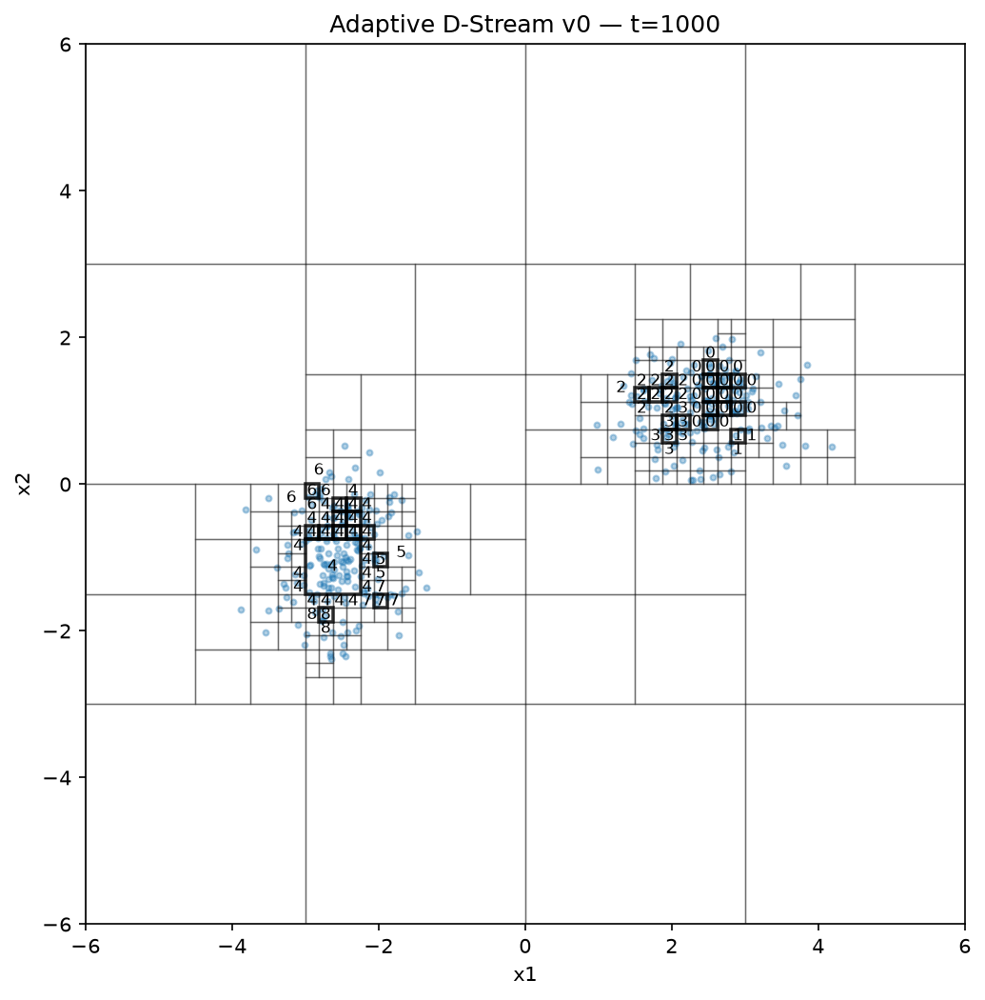
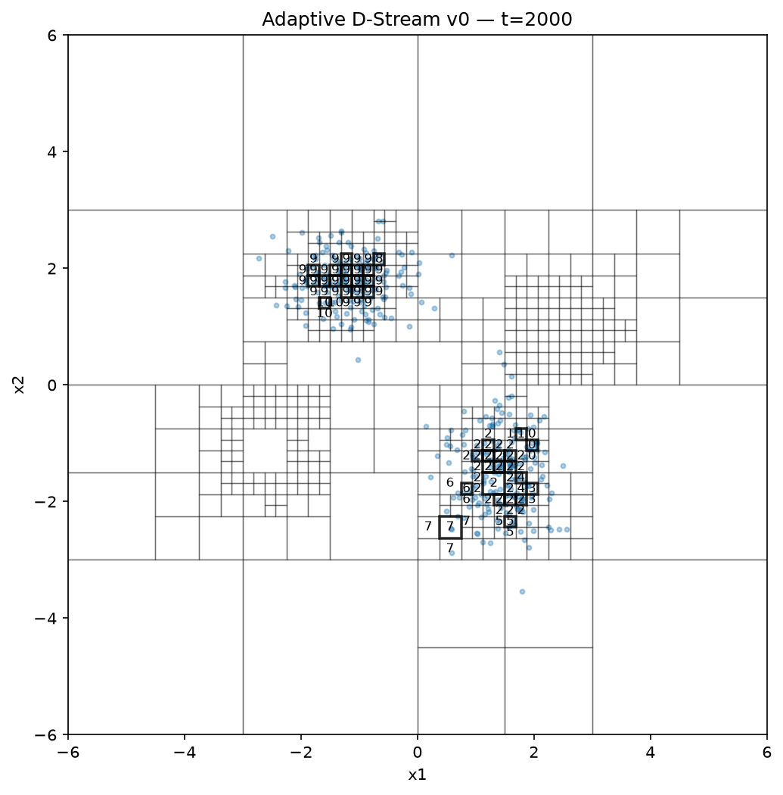
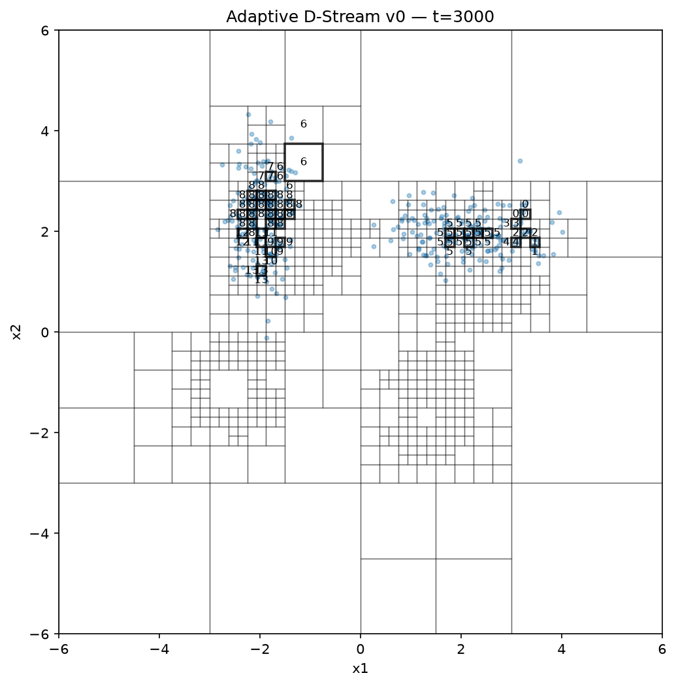
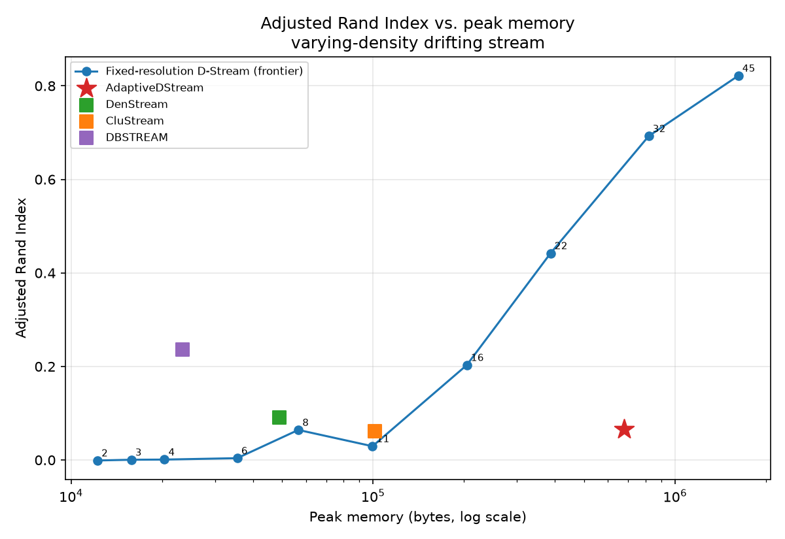
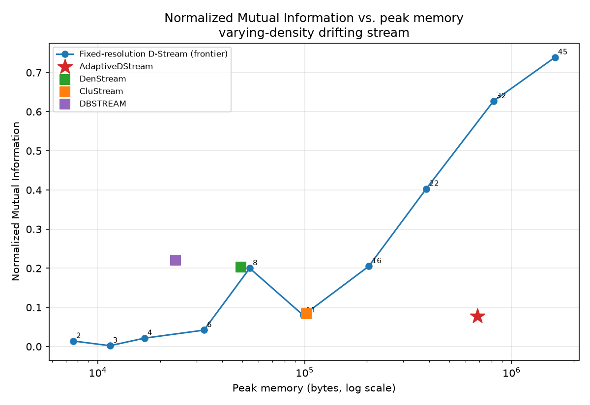

# Adaptive D-Stream

A research prototype for **adaptive multi-resolution density-based clustering of evolving data streams**: a grid-based online clustering method (in the D-Stream family) whose grid cells split themselves where the data locally needs finer resolution, instead of using one fixed cell size everywhere.

## The problem this is trying to solve

Classic grid-based stream clustering (D-Stream, and similar) partitions the space into equal-sized cells once, up front. That one choice of cell size has to work for the whole stream, everywhere, forever. It can't:

- A cell small enough to resolve a **tight, dense** cluster is mostly empty everywhere else, wasting memory on cells that never fill up.
- A cell large enough to keep a **broad, sparse** cluster above the density threshold will swallow the tight cluster whole, or bridge two clusters together the moment they drift close.

If your two clusters happen to have similar density and never move, you'll never see this. The synthetic stream this repo evaluates on is built specifically so a single global resolution *cannot* win: one tight cluster and one broad cluster, present at the same time, drifting. See [Evaluation](#evaluation) below.

`AdaptiveDStream` addresses this by starting with one cell over the whole domain and splitting a cell when its maintained statistics stop looking locally uniform — see [Method](#method).

## Status

This is a week-1, v0 research prototype, not a finished method. The core online-update/split/prune/cluster loop works and is tested; the evaluation harness now exists and the first frontier-sweep results are in (see [Results](#results-so-far)) — and they surface a real, documented limitation (see [Known limitations](#known-limitations)), not a finished win over the baselines. Treat numbers here as a snapshot from `git log`, not a claim.

## Install

```bash
python -m venv .venv
source .venv/bin/activate   # .venv\Scripts\activate on Windows
pip install -r requirements.txt
pip install -e .
```

Dependencies: `numpy`, `matplotlib` (core + plotting), `scikit-learn` (ARI/NMI for evaluation), `river` (imported baselines — DenStream, CluStream, DBSTREAM). All four install cleanly as of Python 3.14.

## Quickstart

Visually inspect the adaptive grid splitting and re-splitting as two Gaussian clusters drift:

```bash
python examples/run_2d_drift.py
```

Snapshots are written to `outputs/state_t{1000,2000,3000}.png`. This uses the original symmetric two-Gaussian stream — good for eyeballing that splitting/pruning/clustering behave sanely, but by design its two clusters are equally easy to resolve at any fixed resolution, so it **cannot discriminate between methods**. That's what the frontier sweep below is for.

| t=1000 | t=2000 | t=3000 |
|---|---|---|
|  |  |  |

Grid lines show the current leaf partition; numbered boxes are dense cells with their assigned cluster id. The grid is coarse where the (broad, sparse) cluster sits and refines sharply around the (tight, dense) cluster — and re-refines as both drift across frames.

Run the actual evaluation — generate the adversarial varying-density stream, sweep a fixed-resolution D-Stream over 10 grid sizes, place `AdaptiveDStream` and three imported baselines on the same accuracy-vs-memory plot:

```bash
python examples/run_frontier_sweep.py
```

This writes:
- `data/varying_density_seed7.{npz,json}` — the generated stream and everything needed to reproduce it exactly (see [Reproducibility](#reproducibility-synthetic-data--seeds)).
- `outputs/frontier_results.json` — every metric for every model.
- `outputs/frontier_ari_vs_memory.png`, `outputs/frontier_nmi_vs_memory.png` — the frontier plots.

## Method

- **One-pass online updates.** Each point updates the sufficient statistics (`s0`, `s1`, `s2` — decayed count, sum, sum-of-squares) of the leaf cell it falls in.
- **Exponential fading.** Statistics decay by a factor `decay ** dt` between updates (`decay ∈ (0,1)`), so old data is gradually forgotten and the model tracks drift.
- **Hierarchical adaptive grid.** Every leaf starts as one cell over the whole domain. A leaf splits into `2**d` children (one split per dimension at once) when its `refinement_score` exceeds `split_threshold`.
- **Refinement score.** Under a uniform distribution inside an axis-aligned cell, `Var(X_j)/h_j² = 1/12` and `E[X_j]` is the cell center. The score measures how far the maintained mean/variance deviate from that — i.e. how badly a uniform-within-cell approximation is currently failing — and triggers a split when it deviates enough. See `GridCell.refinement_score` in [cell.py](src/adaptive_dstream/cell.py).
- **Split mass redistribution (v0 approximation).** Historical raw observations aren't kept, so a split distributes the parent's decayed mass equally across the `2**d` children and initializes each child's moments assuming the parent was locally uniform. This is a known simplification — see [Known limitations](#known-limitations).
- **Dense / transitional / sparse states.** A leaf is `dense` if `s0 ≥ dense_threshold`, `sparse` if `s0 < sparse_threshold`, else `transitional` — see `GridCell.state`.
- **Clustering.** Connected components over face-adjacent dense cells (`AdaptiveDStream._assign_clusters` in [model.py](src/adaptive_dstream/model.py)); a point's predicted cluster is its leaf's `cluster_id`, or `None` if that leaf isn't dense.
- **Pruning.** Leaves that are both sparse and idle for `idle_prune_after` steps are dropped during periodic maintenance.

## Evaluation

### The stream: varying density, present simultaneously, with drift

`make_varying_density_stream` (in [synthetic.py](src/adaptive_dstream/synthetic.py)) generates two clusters that are *always both present*: a tight one (`dense_std`, default `0.18`) and a broad one (`sparse_std`, default `1.6`), each getting roughly half the points at every time step. Both centers drift across `n_phases` (default 3). This is the case a single global cell size provably cannot win — pick a cell small enough for the tight cluster and most of the broad cluster's cells fall below any reasonable density threshold; pick a cell large enough for the broad cluster and the tight cluster is a handful of oversized cells with no internal resolution.

Two other generators exist for variety: `make_drifting_stream` (the original symmetric two-Gaussian stream — kept for the quickstart visualization, not for comparing methods) and `make_moons_stream` (non-convex, non-Gaussian "two moons" shape, rotating and drifting, via `sklearn.datasets.make_moons`). All three share the signature `generate_stream(kind, n_samples, random_state, **kwargs)`.

### Unassigned points: the scoring rule, decided and documented

`predict_point_cluster` returns `None` for a point in a non-dense cell. ARI/NMI/purity are undefined against `None`, so [evaluation.py](src/adaptive_dstream/evaluation.py) maps every unassigned prediction to a sentinel label **`-1`, treated as its own predicted cluster** (never merged with, or silently dropped against, a true label). This is the standard convention for density-based clustering evaluation (DBSCAN/DenStream "noise"): a model that dumps everything into "unassigned" gets scored as if it put all of that into one giant extra cluster — exactly the failure mode ARI/NMI already penalize. `fraction_unassigned` is reported alongside every metric so this isn't hidden inside the headline number. See the module docstring in `evaluation.py` for the full rationale.

### Metrics

`run_stream_eval(model_factory, X, y_true, phase=None, ...)` drives a model over a stream **prequentially** (predict the incoming point's cluster, *then* let the model update on it — never the other way around) and reports:

- **Adjusted Rand Index, Normalized Mutual Information, purity** — overall and broken down `ari_by_phase` for each drift phase.
- **Active cell/cluster count over time** (`active_cells_over_time`), sampled every `snapshot_every` points.
- **Peak memory** — via `tracemalloc`, started before model construction so a fixed grid's `n_cells_per_dim ** dim` allocation is counted, not just the online-update phase.
- **Throughput** (points/second) and **fraction unassigned**.

`model_factory` is a zero-argument callable, not a live model instance — this guarantees every sweep entry starts from a clean state and that construction cost is inside the memory measurement.

### Baselines: imported, not reimplemented

Per the plan, published methods are imported rather than rewritten: [river](https://riverml.xyz/)'s `DenStream`, `CluStream`, and `DBSTREAM`, wrapped by `RiverClusterAdapter` in [baselines.py](src/adaptive_dstream/baselines.py) so they speak the same `partial_fit` / `predict_point_cluster` interface as `AdaptiveDStream`.

The one thing written from scratch is `FixedGridDStream` — a classic, non-adaptive D-Stream at a fixed resolution — because it falls directly out of the existing cell code: it's an `AdaptiveDStream` whose grid is pre-partitioned into an `n_cells_per_dim ** dim` uniform grid at construction and whose `_should_split` always returns `False`. It inherits decay, dense/sparse states, face-adjacency clustering, and prediction unchanged, which makes it a faithful baseline rather than a parallel implementation with subtly different semantics. (It does *not* inherit idle-cell pruning — a fixed grid's defining property is that its partition never changes, so pruning is disabled for it; see the class docstring for why that matters.)

### Reproducibility: synthetic data & seeds

`save_stream(out_dir, name, X, y, phase, generator, seed, params)` writes the arrays to a compressed `.npz` and a sidecar `.json` manifest recording the generator name, seed, parameters, sample count, and dimension. `load_stream` reloads the arrays byte-for-byte; `regenerate_from_manifest` reruns the generator from the manifest alone and is exercised in [tests/test_synthetic.py](tests/test_synthetic.py) to confirm the two match exactly. Every array-producing generator is a pure function of `(random_state, **params)` via `numpy.random.default_rng`, so this reproducibility isn't just "we happened to save the file" — regenerating from the seed is guaranteed to match.

## Results so far

*(2D only, per the current focus — the method and harness are dimension-generic, but higher dimensions are future work.)*

Stream: `make_varying_density_stream`, `n_samples=4000`, `seed=7` (reproducible from `data/varying_density_seed7.json`). Fixed-resolution D-Stream swept at `n_cells_per_dim ∈ {2,3,4,6,8,11,16,22,32,45}`. Full numbers in `outputs/frontier_results.json`.




| Model | Peak memory | ARI | NMI | Fraction unassigned |
|---|---:|---:|---:|---:|
| FixedGrid n=2 | 7.4 KB | 0.000 | 0.008 | 0.00 |
| FixedGrid n=4 | 18.2 KB | 0.002 | 0.045 | 0.03 |
| FixedGrid n=8 | 54.3 KB | 0.048 | 0.148 | 0.11 |
| DBSTREAM | 25.6 KB | 0.166 | 0.172 | 0.00 |
| FixedGrid n=11 | 97.2 KB | 0.093 | 0.152 | 0.19 |
| DenStream | 73.6 KB | 0.128 | 0.261 | 0.00 |
| CluStream | 102.1 KB | 0.037 | 0.042 | 0.00 |
| FixedGrid n=16 | 199.4 KB | 0.299 | 0.274 | 0.36 |
| FixedGrid n=22 | 376.9 KB | 0.474 | 0.414 | 0.46 |
| FixedGrid n=32 | 793.2 KB | 0.614 | 0.551 | 0.53 |
| **AdaptiveDStream** | **1344.3 KB** | **0.106** | **0.107** | **0.42** |
| FixedGrid n=45 | 1568.1 KB | 0.726 | 0.650 | 0.55 |

**AdaptiveDStream is currently dominated, not competitive.** At its own memory budget (1344 KB, between the n=32 and n=45 fixed grids), the fixed-grid frontier scores 0.61–0.73 ARI; AdaptiveDStream scores 0.106. It's also beaten on both axes at once by every river baseline: DBSTREAM reaches higher ARI (0.166) using 50× less memory (25.6 KB). This is the honest week-1 result, not a bug being papered over — `dense_threshold`/`sparse_threshold` for AdaptiveDStream above were themselves re-tuned from the fixed-grid sweep's shared values (2.0/0.3 → 0.5/0.05) after the untuned version scored an even worse ARI of 0.040 at 69% unassigned; retuning helped but plateaued around ARI ≈ 0.10 (see the manual sweep in `examples/run_frontier_sweep.py`'s comment above `adaptive_common`). Two concrete, root-caused reasons, both traceable to how splitting interacts with the current dense/sparse rule:

1. **The dense threshold is an absolute decayed count, not a density.** Splitting a cell fragments its mass across `2**d` children. A region can be genuinely dense (high mass *per unit volume*) while every fine cell covering it holds too little raw count to cross `dense_threshold`, because the same mass is now divided among more cells. No single absolute threshold is right both before and after a region gets refined — which is precisely why retuning only partially helped.
2. **Splitting never frees the parent cell.** `AdaptiveDStream._split` sets `cell.children = [...]` but keeps `cell` itself alive (`is_leaf` becomes `False`, so it's invisible to `leaves()`, but it isn't garbage — its parent's `.children` list still holds a reference to it, along with its own `s0`/`s1`/`s2` arrays). The run above ended with 1309 leaves, implying exactly `(1309-1)/3 = 436` split events and `1309 + 436 = 1745` live `GridCell` objects — as many as a **42×42** fixed grid, not the 36×36 the leaf count alone would suggest. A quarter of AdaptiveDStream's memory in this run is retired parent cells that no longer serve any lookup.

Both point the same direction: the fix isn't the splitting heuristic itself, it's making the dense/sparse rule and memory accounting resolution-aware. See [Known limitations](#known-limitations).

## Known limitations

- **Dense-threshold is an absolute decayed count, not normalized by cell volume.** This is the most consequential current limitation. Splitting a cell fragments its mass across `2**d` smaller children; a region can be genuinely dense (high mass *per unit volume*) while every individual fine cell covering it holds too little raw count to cross `dense_threshold`, because that same mass is now divided among many more cells. A threshold tuned for a coarse fixed grid can therefore make `AdaptiveDStream` systematically under-classify dense regions once it refines them — the more successfully it adapts, the more it can undercut its own dense-cell threshold. The original D-Stream formulation compares *density* (count / cell volume) against a threshold; moving to that here (or otherwise scaling `dense_threshold`/`sparse_threshold` with cell volume) is the top item for week 2.
- **A split cell's own `GridCell` object is never freed.** `_split` gives `cell` children but keeps `cell` itself alive in the tree (invisible to `leaves()` once it's not a leaf, but still referenced by its parent and still holding its own `s0`/`s1`/`s2` arrays). Memory therefore tracks the cumulative number of splits ever performed, not the current leaf count — in the run behind [Results so far](#results-so-far), 1309 final leaves implied 436 retired parents still resident, i.e. a quarter of the model's memory was dead weight. Freeing (or reusing) a cell's storage once it has children is the second week-2 item, alongside density normalization above.
- Split mass redistribution assumes local uniformity within the parent cell (see [Method](#method)) — untested against moment-based redistribution or a bounded reservoir.
- Dense-cell adjacency for clustering is `O(m²)` in the number of dense cells.
- Splitting always refines every dimension at once (`2**d` children), never a single dimension.
- No merge/contraction of over-refined cells, only idle-sparse pruning.
- No ANN/LSH indexing; `FixedGridDStream._find_leaf` is `O(1)` arithmetic indexing, but `AdaptiveDStream._find_leaf` walks the tree.
- 2D only, by current focus, not by design constraint — `GridCell`/`AdaptiveDStream` are dimension-generic (`2**d` children, per-axis bounds), but nothing above 2D has been run or evaluated yet.

## Repository layout

```
src/adaptive_dstream/
  cell.py          GridCell: sufficient statistics, decay, refinement score, state
  model.py         AdaptiveDStream: split/prune/cluster/predict loop
  baselines.py     FixedGridDStream + RiverClusterAdapter (DenStream/CluStream/DBSTREAM)
  synthetic.py     Stream generators + reproducible save/load
  evaluation.py    Prequential eval harness: ARI/NMI/purity/memory/throughput
  plotting.py      2D grid-state visualization
examples/
  run_2d_drift.py        Quickstart visualization on the symmetric two-Gaussian stream
  run_frontier_sweep.py  The evaluation in this README
tests/
data/          generated streams: {name}.npz (arrays) + {name}.json (seed/params manifest), committed
outputs/       plots and result JSON land here
```

## Contributing / next steps

See [Known limitations](#known-limitations) for the ranked list. The immediate next steps, in order, are (1) density-normalized dense/sparse thresholds and (2) freeing a cell's storage once it has children, then re-running the frontier sweep to see how much of the gap to the fixed-grid frontier those two account for before touching the splitting heuristic itself.
