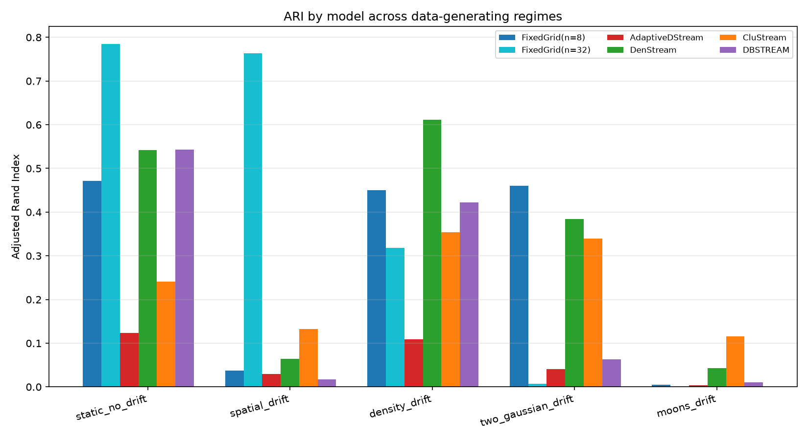
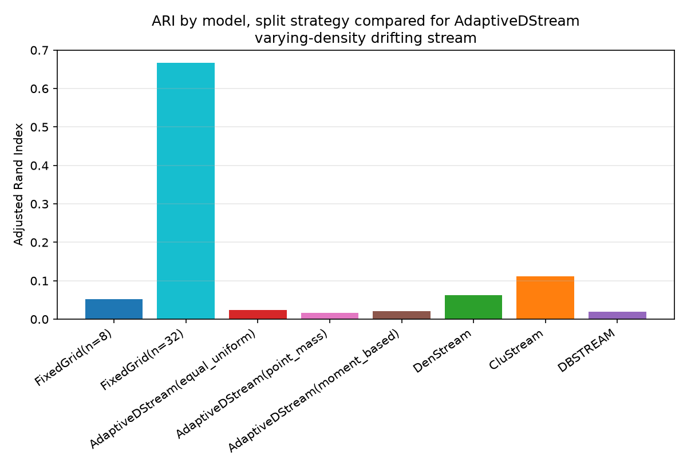
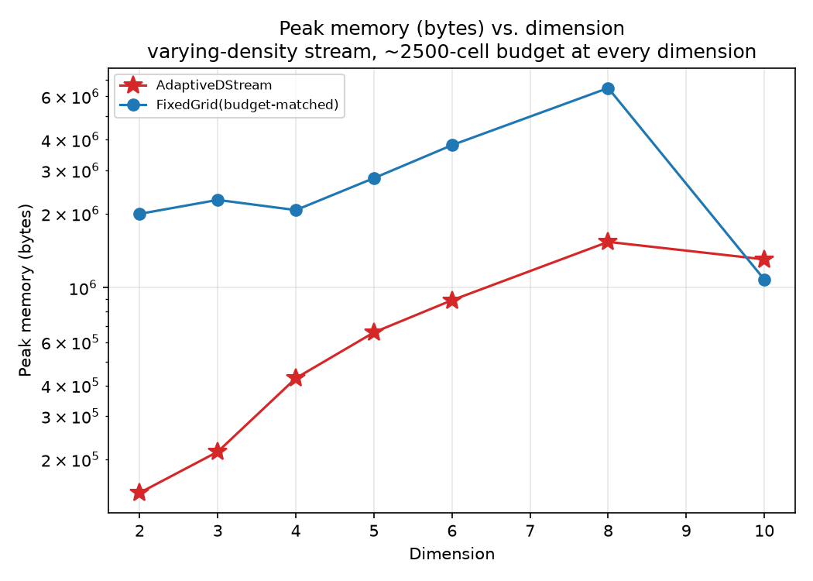
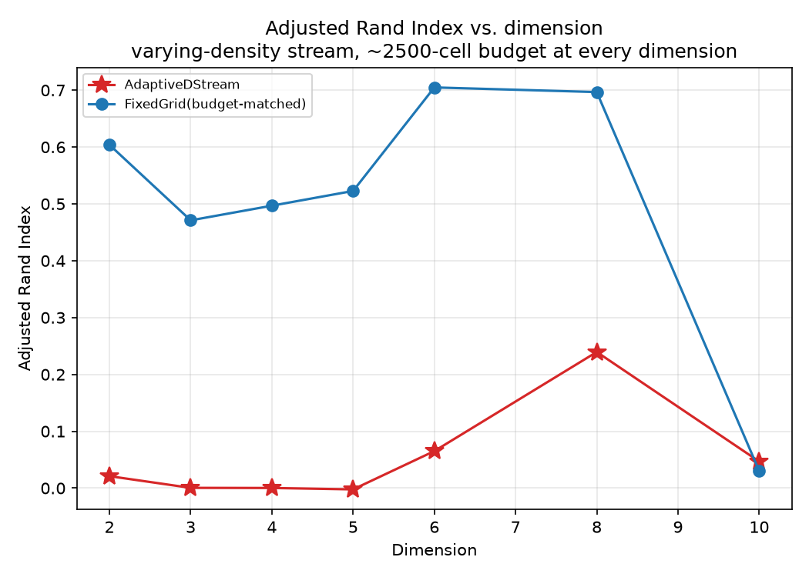

# Adaptive D-Stream

A research prototype for **adaptive multi-resolution density-based clustering of evolving data streams**: a grid-based online clustering method (in the D-Stream family) whose grid cells split themselves where the data locally needs finer resolution, instead of using one fixed cell size everywhere.

## The problem this is trying to solve

Classic grid-based stream clustering (D-Stream, and similar) partitions the space into equal-sized cells once, up front. That one choice of cell size has to work for the whole stream, everywhere, forever. It can't:

- A cell small enough to resolve a **tight, dense** cluster is mostly empty everywhere else, wasting memory on cells that never fill up.
- A cell large enough to keep a **broad, sparse** cluster above the density threshold will swallow the tight cluster whole, or bridge two clusters together the moment they drift close.

If your two clusters happen to have similar density and never move, you'll never see this. The synthetic stream this repo evaluates on is built specifically so a single global resolution *cannot* win: one tight cluster and one broad cluster, present at the same time, drifting. See [Evaluation](#evaluation) below.

`AdaptiveDStream` addresses this by starting with one cell over the whole domain and splitting a cell when its maintained statistics stop looking locally uniform — see [Method](#method).

## Status

This is a week-1, v0 research prototype, not a finished method. The core online-update/split/prune/cluster loop works and is tested; the evaluation harness now exists and the first frontier-sweep results are in (see [Results](#results-so-far)) — and they surface a real, documented limitation (see [Known limitations](#known-limitations)), not a finished win over the baselines. Treat numbers here as a snapshot from `git log`, not a claim.

## Install

```bash
python -m venv .venv
source .venv/bin/activate   # .venv\Scripts\activate on Windows
pip install -r requirements.txt
pip install -e .
```

Dependencies: `numpy`, `matplotlib` (core + plotting), `scikit-learn` (ARI/NMI for evaluation), `river` (imported baselines — DenStream, CluStream, DBSTREAM). All four install cleanly as of Python 3.14.

## Quickstart

Visually inspect the adaptive grid splitting and re-splitting as two Gaussian clusters drift:

```bash
python examples/run_2d_drift.py
```

Snapshots are written to `outputs/state_t{1000,2000,3000}.png`. This uses the original symmetric two-Gaussian stream — good for eyeballing that splitting/pruning/clustering behave sanely, but by design its two clusters are equally easy to resolve at any fixed resolution, so it **cannot discriminate between methods**. That's what the frontier sweep below is for.

| t=1000 | t=2000 | t=3000 |
|---|---|---|
|  |  |  |

Grid lines show the current leaf partition; numbered boxes are dense cells with their assigned cluster id. The grid is coarse where the (broad, sparse) cluster sits and refines sharply around the (tight, dense) cluster — and re-refines as both drift across frames.

Run the actual evaluation — generate the adversarial varying-density stream, sweep a fixed-resolution D-Stream over 10 grid sizes, place `AdaptiveDStream` and three imported baselines on the same accuracy-vs-memory plot:

```bash
python examples/run_frontier_sweep.py
```

This writes:
- `data/varying_density_seed7.{npz,json}` — the generated stream and everything needed to reproduce it exactly (see [Reproducibility](#reproducibility-synthetic-data--seeds)).
- `outputs/frontier_results.json` — every metric for every model.
- `outputs/frontier_ari_vs_memory.png`, `outputs/frontier_nmi_vs_memory.png` — the frontier plots.

Both examples default to `dim=2` — deliberately, since the headline results above and the grid-partition visualization are both 2D — but every stream generator, `AdaptiveDStream` itself, and the evaluation harness are dimension-generic. Pass `--dim` to try another dimension, e.g. `python examples/run_2d_drift.py --dim 3`; see [Higher dimensions](#higher-dimensions) for what changes (and what doesn't) as `dim` grows.

## Method

- **One-pass online updates.** Each point updates the sufficient statistics (`s0`, `s1`, `s2` — decayed count, sum, sum-of-squares) of the leaf cell it falls in.
- **Exponential fading.** Statistics decay by a factor `decay ** dt` between updates (`decay ∈ (0,1)`), so old data is gradually forgotten and the model tracks drift.
- **Hierarchical adaptive grid.** Every leaf starts as one cell over the whole domain. A leaf splits into `2**d` children (one split per dimension at once) when its `refinement_score` exceeds `split_threshold`.
- **Refinement score.** Under a uniform distribution inside an axis-aligned cell, `Var(X_j)/h_j² = 1/12` and `E[X_j]` is the cell center. The score measures how far the maintained mean/variance deviate from that — i.e. how badly a uniform-within-cell approximation is currently failing — and triggers a split when it deviates enough. See `GridCell.refinement_score` in [cell.py](src/adaptive_dstream/cell.py).
- **Split mass redistribution — three strategies (`split_strategy`).** Historical raw observations aren't kept, so a split has to redistribute the parent's decayed mass across its `2**d` children from summary statistics alone. Three strategies are implemented, selectable via `AdaptiveDStream(split_strategy=...)`:
  - `"equal_uniform"` (default, the original v0 behavior): mass split equally across children, each child's moments initialized assuming the parent was locally uniform.
  - `"point_mass"`: a degenerate baseline — all of the parent's mass and history are handed to whichever single child contains the parent's tracked mean; the rest get nothing.
  - `"moment_based"`: models the parent's within-cell distribution as an axis-independent Gaussian matching its tracked mean/variance, truncated to the parent's bounds, and gives each child exactly the Gaussian mass (and the corresponding truncated-normal mean/variance) its half-interval implies per axis — mass conserves to the parent's total exactly, by construction, across all `2**d` children.

  See `AdaptiveDStream._redistribute_*` in [model.py](src/adaptive_dstream/model.py).
- **Contraction.** A fully-split cell's children are merged back into it during maintenance when none of them individually still need the resolution (`max` child `refinement_score` `< merge_threshold`), aggregating their live decayed statistics into the parent, which becomes a leaf again. Guarded by `merge_min_age`: a cell's children score exactly 0 immediately after an `equal_uniform`/`moment_based` split (their moments are set to match the assumed-uniform baseline `refinement_score` measures deviation from), so without an age gate a split could be undone on the very next maintenance call regardless of how it was seeded. See `AdaptiveDStream._contract_recursive`/`_merge_children`.
- **Dense / transitional / sparse states.** A leaf is `dense` if `s0 ≥ dense_threshold`, `sparse` if `s0 < sparse_threshold`, else `transitional` — see `GridCell.state`.
- **Clustering.** Connected components over face-adjacent dense cells (`AdaptiveDStream._assign_clusters` in [model.py](src/adaptive_dstream/model.py)) give each dense cell a `cluster_id`. A transitional cell that is face-adjacent to a dense cluster is then attached to it (its highest-density dense neighbor, if more than one qualifies) — the DBSCAN border-point rule. A point's predicted cluster is its leaf's `cluster_id`, or `None` if that leaf is sparse, or transitional with no dense neighbor.
- **Pruning.** Leaves that are both sparse and idle for `idle_prune_after` steps are dropped during periodic maintenance.

## Evaluation

### The stream: varying density, present simultaneously, with drift

`make_varying_density_stream` (in [synthetic.py](src/adaptive_dstream/synthetic.py)) generates two clusters that are *always both present*: a tight one (`dense_std`, default `0.18`) and a broad one (`sparse_std`, default `1.6`), each getting roughly half the points at every time step. Both centers drift across `n_phases` (default 3). This is the case a single global cell size provably cannot win — pick a cell small enough for the tight cluster and most of the broad cluster's cells fall below any reasonable density threshold; pick a cell large enough for the broad cluster and the tight cluster is a handful of oversized cells with no internal resolution.

Two extra parameters isolate *which* kind of change in the stream is driving a model's behavior:

- **`drift: bool = True`.** With `drift=False`, both cluster centers are frozen at their phase-0 location for the whole stream — a static, no-drift control. Comparing a model's score with `drift=True` vs. `drift=False` on an otherwise identical stream separates "this model struggles with the density mismatch" from "this model struggles with drift specifically."
- **`dense_std_schedule` / `sparse_std_schedule: Sequence[float] | None = None`** (each, if given, of length `n_phases`). Overrides the corresponding cluster's standard deviation per phase, so *local density itself* can change over time independent of position — e.g. `drift=False` with a `dense_std_schedule` that widens phase-by-phase tests split/merge behavior in isolation from any relocation.

See [Results across regimes](#results-across-regimes) below for what these isolate in practice.

Two other generators exist for variety: `make_drifting_stream` (the original symmetric two-Gaussian stream — kept for the quickstart visualization, not for comparing methods) and `make_moons_stream` (non-convex, non-Gaussian "two moons" shape, rotating and drifting, via `sklearn.datasets.make_moons`). All three share the signature `generate_stream(kind, n_samples, random_state, **kwargs)` and now take a `dim` keyword (default 2, exactly reproducing the original streams bit-for-bit); for `dim != 2` the cluster centers orbit the origin in the leading one or two axes (`synthetic._orbit_centers`) so the "always separated, drifting" shape generalizes to any dimension, with `make_moons_stream` requiring `dim >= 2` since the moon shape itself is inherently 2D. See [Higher dimensions](#higher-dimensions).

### Unassigned points: the scoring rule, decided and documented

`predict_point_cluster` returns `None` for a point in a non-dense cell. ARI/NMI/purity are undefined against `None`, so [evaluation.py](src/adaptive_dstream/evaluation.py) maps every unassigned prediction to a sentinel label **`-1`, treated as its own predicted cluster** (never merged with, or silently dropped against, a true label). This is the standard convention for density-based clustering evaluation (DBSCAN/DenStream "noise"): a model that dumps everything into "unassigned" gets scored as if it put all of that into one giant extra cluster — exactly the failure mode ARI/NMI already penalize. `fraction_unassigned` is reported alongside every metric so this isn't hidden inside the headline number. See the module docstring in `evaluation.py` for the full rationale.

### Metrics

`run_stream_eval(model_factory, X, y_true, phase=None, ...)` drives a model over a stream **prequentially** (predict the incoming point's cluster, *then* let the model update on it — never the other way around) and reports:

- **Adjusted Rand Index, Normalized Mutual Information, purity** — overall and broken down `ari_by_phase` for each drift phase.
- **Active cell/cluster count over time** (`active_cells_over_time`), sampled every `snapshot_every` points.
- **Peak memory** — via `tracemalloc`, started before model construction so a fixed grid's `n_cells_per_dim ** dim` allocation is counted, not just the online-update phase.
- **Throughput** (points/second) and **fraction unassigned**.

`model_factory` is a zero-argument callable, not a live model instance — this guarantees every sweep entry starts from a clean state and that construction cost is inside the memory measurement.

### Baselines: imported, not reimplemented

Per the plan, published methods are imported rather than rewritten: [river](https://riverml.xyz/)'s `DenStream`, `CluStream`, and `DBSTREAM`, wrapped by `RiverClusterAdapter` in [baselines.py](src/adaptive_dstream/baselines.py) so they speak the same `partial_fit` / `predict_point_cluster` interface as `AdaptiveDStream`.

The one thing written from scratch is `FixedGridDStream` — a classic, non-adaptive D-Stream at a fixed resolution — because it falls directly out of the existing cell code: it's an `AdaptiveDStream` whose grid is pre-partitioned into an `n_cells_per_dim ** dim` uniform grid at construction and whose `_should_split` always returns `False`. It inherits decay, dense/sparse states, face-adjacency clustering, and prediction unchanged, which makes it a faithful baseline rather than a parallel implementation with subtly different semantics. (It does *not* inherit idle-cell pruning — a fixed grid's defining property is that its partition never changes, so pruning is disabled for it; see the class docstring for why that matters.)

### Reproducibility: synthetic data & seeds

`save_stream(out_dir, name, X, y, phase, generator, seed, params)` writes the arrays to a compressed `.npz` and a sidecar `.json` manifest recording the generator name, seed, parameters, sample count, and dimension. `load_stream` reloads the arrays byte-for-byte; `regenerate_from_manifest` reruns the generator from the manifest alone and is exercised in [tests/test_synthetic.py](tests/test_synthetic.py) to confirm the two match exactly. Every array-producing generator is a pure function of `(random_state, **params)` via `numpy.random.default_rng`, so this reproducibility isn't just "we happened to save the file" — regenerating from the seed is guaranteed to match.

## Results so far

*(2D, per the current focus — the method and harness are dimension-generic, and a first, preliminary look at higher dimensions is in [Higher dimensions](#higher-dimensions) below.)*

Stream: `make_varying_density_stream`, `n_samples=2000`, `seed=7` (reproducible from `data/varying_density_seed7.json`). Fixed-resolution D-Stream swept at `n_cells_per_dim ∈ {2,3,4,6,8,11,16,22,32,45}`. `AdaptiveDStream` now includes contraction (`merge_threshold=0.01`, `merge_min_age=200`) and the transitional-cell border assignment described in [Method](#method), on top of the original split/prune loop. Full numbers in `outputs/frontier_results.json`.

*(`n_samples` was reduced from the original 4000: contraction and the transitional-cell pass both add per-point cost on top of the already-documented `O(dense²)` clustering-adjacency check that runs on every point, not just every maintenance interval — see `examples/run_frontier_sweep.py`'s `N_SAMPLES` comment. The qualitative pattern below is corroborated by the [regime sweep](#results-across-regimes) at its own, independently-reduced sample size, but a full-scale re-run at `n=4000` is still the more rigorous version of this comparison.)*


| Model | Peak memory | ARI | NMI | Fraction unassigned |
|---|---:|---:|---:|---:|
| FixedGrid n=2 | 7.4 KB | -0.001 | 0.014 | 0.00 |
| FixedGrid n=3 | 11.2 KB | 0.001 | 0.002 | 0.01 |
| FixedGrid n=4 | 16.4 KB | 0.001 | 0.021 | 0.01 |
| DBSTREAM | 23.2 KB | 0.236 | 0.221 | 0.00 |
| FixedGrid n=6 | 31.8 KB | 0.004 | 0.042 | 0.03 |
| DenStream | 47.9 KB | 0.092 | 0.202 | 0.00 |
| FixedGrid n=8 | 53.0 KB | 0.064 | 0.200 | 0.04 |
| FixedGrid n=11 | 96.2 KB | 0.029 | 0.080 | 0.10 |
| CluStream | 99.6 KB | 0.061 | 0.084 | 0.00 |
| FixedGrid n=16 | 199.4 KB | 0.203 | 0.205 | 0.27 |
| FixedGrid n=22 | 378.0 KB | 0.442 | 0.403 | 0.42 |
| **AdaptiveDStream** | **666.4 KB** | **0.066** | **0.078** | **0.21** |
| FixedGrid n=32 | 798.6 KB | 0.692 | 0.627 | 0.48 |
| FixedGrid n=45 | 1581.3 KB | 0.822 | 0.739 | 0.51 |

**AdaptiveDStream is still dominated on ARI — but contraction and transitional assignment measurably fixed the two things they targeted.** Compared to the original (`n=4000`, pre-contraction) run: peak memory roughly halved in proportion (1344 KB → 666 KB at half the sample count) and, more tellingly, **fraction unassigned dropped from 0.42 to 0.21** — the transitional-cell border-assignment rule (see [Method](#method)) is doing real work, no longer leaving every non-dense leaf's points unlabeled. What it did *not* do is close the ARI gap: 0.066 here is, if anything, slightly below the original run's 0.106, and AdaptiveDStream remains dominated by the fixed-grid frontier at comparable memory (0.69–0.82 ARI at n=32/45) and by DBSTREAM (0.236 at 23 KB, still ~30× less memory). The same pattern — memory and unassigned fraction improve substantially, ARI does not — repeats independently in the [regime sweep](#results-across-regimes) below, which is evidence this isn't sample-size noise from the smaller `n`.

This is consistent with the root cause never having been about memory accounting or unassigned points in the first place:

1. **The dense threshold is still an absolute decayed count, not a density.** Splitting a cell fragments its mass across `2**d` children. A region can be genuinely dense (high mass *per unit volume*) while every fine cell covering it holds too little raw count to cross `dense_threshold`, because the same mass is now divided among more cells. No single absolute threshold is right both before and after a region gets refined. **This is unchanged by the new split strategies, contraction, or transitional assignment** — none of the three touch how `dense_threshold`/`sparse_threshold` are compared against `s0`, so this remains the top item for the next iteration.
2. **Splitting still doesn't fully free a parent cell's memory — contraction only reclaims it conditionally.** A direct instrumented comparison on this same stream/config: **without** contraction, the run ends with 754 leaves and 1005 total live `GridCell` objects (251 retired parents, ~25% dead weight — matching the original finding almost exactly). **With** contraction enabled, it ends with 637 leaves and 849 total objects (212 retired parents) — a real ~15% reduction in total live cells, but the underlying issue isn't eliminated: a cell whose children keep legitimately deviating from the uniform assumption (i.e. a real, persistent cluster) never satisfies the merge criterion and its stale parent stays resident indefinitely, same as before. Contraction helps idle/over-refined regions specifically; it doesn't change the fact that permanently-split cells still carry dead parent objects.

Both point the same direction as before: the fix isn't the splitting heuristic itself, it's making the dense/sparse rule resolution-aware. See [Known limitations](#known-limitations).

## Results across regimes

The frontier sweep above answers "accuracy vs. memory on one stream." This asks a different question: does a *single, fixed* hyperparameter choice generalize across qualitatively different regimes, or does the right answer depend on what the data is doing? No model below is retuned per regime — `AdaptiveDStream` and the two `FixedGridDStream` resolutions keep the exact hyperparameters from the frontier sweep, and only the data changes.

Five regimes, all `n_samples=500`, `seed=7` (reduced from 2000 for the same reason as the frontier sweep — see its note above). `AdaptiveDStream` here includes contraction and transitional assignment, same as the frontier sweep.

| Regime | Generator / params | Isolates |
|---|---|---|
| `static_no_drift` | `varying_density`, `drift=False` | Density mismatch alone, no drift at all |
| `spatial_drift` | `varying_density`, `drift=True` (default) | Density mismatch + spatial drift (the frontier-sweep stream) |
| `density_drift` | `varying_density`, `drift=False`, `dense_std_schedule=[0.15,0.15,1.1]` | Local density changing with centers held fixed |
| `two_gaussian_drift` | `make_drifting_stream` (symmetric two-Gaussian) | Spatial drift with *no* density mismatch |
| `moons_drift` | `make_moons_stream` | Non-convex, non-Gaussian shape + rotation/drift |



| Regime | FixedGrid n=8 | FixedGrid n=32 | **AdaptiveDStream** | DenStream | CluStream | DBSTREAM |
|---|---:|---:|---:|---:|---:|---:|
| static_no_drift | 0.472 | 0.785 | **0.123** | 0.542 | 0.241 | 0.543 |
| spatial_drift | 0.037 | 0.764 | **0.030** | 0.064 | 0.133 | 0.017 |
| density_drift | 0.450 | 0.318 | **0.109** | 0.611 | 0.354 | 0.422 |
| two_gaussian_drift | 0.460 | 0.008 | **0.041** | 0.384 | 0.340 | 0.063 |
| moons_drift | 0.004 | 0.001 | **0.004** | 0.043 | 0.116 | 0.010 |

(ARI shown; full metrics including NMI, purity, peak memory, and fraction unassigned are in `outputs/regime_sweep_results.json`. Peak memory bands, for context: FixedGrid n=8 ≈ 52–57 KB, FixedGrid n=32 ≈ 797–810 KB, **AdaptiveDStream ≈ 183–270 KB** (down from ≈676–1296 KB pre-contraction), DenStream ≈ 15–37 KB, CluStream ≈ 95–99 KB, DBSTREAM ≈ 17–36 KB across regimes. Fraction unassigned for AdaptiveDStream is now 0.02–0.05 across every regime, down from 0.34–0.53 before transitional-cell assignment.)

**No single fixed resolution wins across regimes — which is the whole motivating premise for adaptivity, and it holds up empirically.** `spatial_drift` and `two_gaussian_drift` are the clearest contrast: the fine grid (`n=32`) wins `spatial_drift` by a wide margin (0.764 vs. `n=8`'s 0.037, since only fine cells can resolve the tight cluster as it moves) and then collapses on `two_gaussian_drift` (0.008 vs. `n=8`'s 0.460) — cells fine enough for the adversarial density-mismatch stream are too fine for a stream with no density mismatch to justify them, so a moving symmetric cluster leaves too little decayed mass in any one fine cell before drifting onward. `density_drift` shows the same reversal from the other side (coarse wins, 0.450 vs. 0.318). Whichever resolution you'd pick up front, some regime here breaks it.

**`AdaptiveDStream` is dominated in every regime, including the no-drift static control — but contraction and transitional assignment visibly moved the needle without closing the gap.** Peak memory and fraction-unassigned both improved substantially and consistently across all five regimes (see the bands above) — the two features are doing exactly what they were built to do. ARI itself moved in *both* directions depending on the regime (up in `static_no_drift` 0.043→0.123, `density_drift` 0.070→0.109, and `two_gaussian_drift` 0.006→0.041; down in `spatial_drift` 0.084→0.030; flat in `moons_drift`) — a mixed, modest pattern, not a clear win. `static_no_drift` remains far from AdaptiveDStream's best case relative to the baselines (0.123 vs. 0.785/0.543 for the best fixed grid/river model there), consistent with the [Known limitations](#known-limitations) being structural rather than drift-related: the non-volume-normalized dense threshold is untouched by either new feature.

**The `moons_drift` regime defeats everything, uniformly.** No grid-based model exceeds ARI 0.004 there, and the river baselines top out at 0.116 (CluStream). Axis-aligned rectangular cells — and face-adjacency connectivity across them — are a poor fit for a non-convex boundary at any resolution; this is a shape limitation, not a resolution or drift one, and no amount of retuning the models tested here would fix it.

**Among the river baselines, DenStream and DBSTREAM remain the most consistently competitive, without any retuning.** DenStream is strongest on `static_no_drift`, `density_drift`, and `two_gaussian_drift`; DBSTREAM is close behind on the first two. Both do this at 15–37 KB — an order of magnitude or more less memory than either fixed grid or `AdaptiveDStream`.

Reproduce with `python examples/run_regime_sweep.py`.

## Split-strategy comparison

`AdaptiveDStream._split` never kept raw observations, so redistributing a cell's mass to its `2**d` children on split has to be inferred from summary statistics alone. Three strategies are implemented (see [Method](#method)): `equal_uniform` (the original default), `point_mass` (a degenerate baseline — all mass to whichever child contains the tracked mean), and `moment_based` (an axis-independent truncated-Gaussian model of the parent, giving each child its implied Gaussian mass and moments). This compares all three, with contraction enabled, on the same `varying_density` (`drift=True`) stream, `n_samples=800`, `seed=7`, alongside `FixedGridDStream` at two resolutions and the three `river` baselines — nothing here is retuned per strategy.



| Model | Peak memory | ARI | NMI | Fraction unassigned |
|---|---:|---:|---:|---:|
| DBSTREAM | 22.3 KB | 0.019 | 0.048 | 0.00 |
| FixedGrid n=8 | 55.7 KB | 0.052 | 0.172 | 0.08 |
| DenStream | 40.2 KB | 0.062 | 0.155 | 0.00 |
| CluStream | 98.9 KB | 0.112 | 0.118 | 0.00 |
| AdaptiveDStream (`equal_uniform`) | 315.6 KB | **0.024** | 0.084 | 0.07 |
| AdaptiveDStream (`moment_based`) | 391.4 KB | **0.021** | 0.066 | 0.10 |
| AdaptiveDStream (`point_mass`) | 447.2 KB | **0.017** | 0.037 | 0.34 |
| FixedGrid n=32 | 797.8 KB | 0.667 | 0.594 | 0.53 |

**`equal_uniform`, the simplest strategy, is narrowly the best of the three — and `point_mass` is clearly the worst, for an explainable reason.** `point_mass` hands each split's entire mass to a single child and leaves the other `2**d - 1` children at exactly zero — those children are then permanently `sparse` until real new data arrives, so more of the domain goes unrepresented by any dense cell: fraction unassigned (0.34) is 3–5× the other two strategies', and it uses the most memory of the three despite that (creating a full `GridCell` for children that stay empty is not free). `moment_based` sits in between, as expected — it spreads mass more realistically than `point_mass` (see the exact-conservation and mean-skew tests in `tests/test_model.py`) but still concentrates most of it near the tracked mean, which costs it slightly relative to `equal_uniform`'s even split on *this* stream. None of the three strategies gets AdaptiveDStream close to the fixed-grid or river baselines — this experiment isolates the split-mass-redistribution question specifically, and the answer is that it is not where the current ARI gap comes from; see [Known limitations](#known-limitations).

Reproduce with `python examples/run_split_strategy_sweep.py`.

## Higher dimensions

*(Preliminary: one seed, hyperparameters not retuned per dimension, and every dimension beyond the first two is pure uninformative noise by construction — see caveats below. Not a replacement for the 2D headline result above.)*

The core model was already dimension-generic (`GridCell`/`AdaptiveDStream` use `2**d` children and per-axis bounds throughout, unchanged here); what's new is that the stream generators, evaluation harness, and visualization now actually exercise `dim != 2`. `examples/run_dimension_sweep.py` tests the natural follow-up question this raises: does `AdaptiveDStream`'s standing relative to a fixed grid improve as dimension grows? A fixed grid's cell count is `n_cells_per_dim ** dim` — exponential, paid unconditionally regardless of where the data is — while `AdaptiveDStream` only refines where the data needs it and is hard-capped at `max_cells`.

Same `varying_density` stream as the headline result (`n_samples=400`, `seed=7`; reduced from 2500 — see the frontier sweep's note above, cost at high dimension is worse still since a split now costs `O(2**dim)` regardless of strategy and contraction adds a second full-tree pass every maintenance interval), generalized so the two cluster centers orbit in the first two coordinates and every additional dimension is pure isotropic noise (the standard curse-of-dimensionality stress case, not an easier or harder version of the clustering problem). At each dimension, the fixed grid's `n_cells_per_dim` is chosen so its total cell count lands near a ~2,500-cell budget — the same order as `AdaptiveDStream`'s `max_cells=2500` — so this compares the two models at roughly matched memory rather than matched raw resolution. `AdaptiveDStream` includes contraction and transitional assignment here too.




| Dim | Model | Cells | Peak memory | ARI | NMI |
|---:|---|---:|---:|---:|---:|
| 2 | FixedGrid (n=50) | 2,500 | 1949.8 KB | 0.604 | 0.574 |
| 2 | **AdaptiveDStream** | 136 | **143.0 KB** | 0.021 | 0.099 |
| 3 | FixedGrid (n=14) | 2,744 | 2221.4 KB | 0.471 | 0.460 |
| 3 | **AdaptiveDStream** | 225 | **210.1 KB** | 0.000 | 0.038 |
| 4 | FixedGrid (n=7) | 2,401 | 2019.8 KB | 0.497 | 0.464 |
| 4 | **AdaptiveDStream** | 466 | **418.5 KB** | 0.000 | 0.030 |
| 5 | FixedGrid (n=5) | 3,125 | 2724.6 KB | 0.523 | 0.466 |
| 5 | **AdaptiveDStream** | 714 | **642.5 KB** | -0.002 | 0.034 |
| 6 | FixedGrid (n=4) | 4,096 | 3711.0 KB | 0.705 | 0.599 |
| 6 | **AdaptiveDStream** | 946 | **868.5 KB** | 0.065 | 0.156 |
| 8 | FixedGrid (n=3) | 6,561 | 6334.4 KB | 0.697 | 0.618 |
| 8 | **AdaptiveDStream** | 1,531 | **1499.6 KB** | 0.239 | 0.212 |
| 10 | FixedGrid (n=2) | 1,024 | 1053.5 KB | 0.030 | 0.159 |
| 10 | **AdaptiveDStream** | 1,024 | **1272.8 KB** | 0.047 | 0.116 |

Full numbers in `outputs/dimension_sweep_results.json`.

**The memory hypothesis holds more strongly than before; the accuracy gap still narrows at high dimension but the pattern is noisier at the smaller sample size.**

- **Memory: `AdaptiveDStream`'s advantage is now larger at every dimension it holds at all.** From dim 2 to 8, `AdaptiveDStream` uses only 7–24% of the budget-matched fixed grid's memory (143 KB vs 1950 KB at dim=2; 1500 KB vs 6334 KB at dim=8) — a bigger relative gap than the pre-contraction run's 35–87%, since contraction now reclaims memory from stale splits on top of the cap that was already there. The fixed grid still can't be tuned finely to a memory budget at high dimension for the same reason as before: `n_cells_per_dim` only moves in coarse integer steps, so at dim=8 the jump from `n=2` (256 cells) to `n=3` (6,561 cells) overshoots the 2,500-cell target by 2.6×. At dim=10 the fixed grid again drops *under* budget (1054 KB) purely because `n_cells_per_dim` bottoms out at 2, and `AdaptiveDStream` (1273 KB) is the larger of the two there, same direction as before.
- **Accuracy: `AdaptiveDStream` is dominated for dim 2–6, and the gap narrows at dim=8 exactly as before (ARI 34% of the fixed grid's, up from single digits at low dimension).** This is consistent with the same root cause (see [Known limitations](#known-limitations)): a split fragments mass across `2**dim` children, a far harsher penalty at dim=8 (256-way) than at dim=2 (4-way), and the dense threshold is still an absolute count, unaffected by contraction or transitional assignment. At dim=10, `AdaptiveDStream` (0.047) nominally exceeds the fixed grid (0.030) for the first time — but the fixed grid's ARI collapsed sharply here (0.486 in the earlier, larger-sample run vs. 0.030 now), most plausibly a small-sample artifact of `n=2`-per-axis being an extremely coarse grid at `n_samples=400`, not evidence that `AdaptiveDStream` overtook it on merit.

**Caveats, so this isn't overread:** single seed, `n_samples=400` (smaller than both the previous dimension-sweep run and the 2D headline result), and neither model's `dense_threshold`/`sparse_threshold` was retuned per dimension — both remain absolute decayed counts, so the known limitation above is a confound here, not something this experiment isolates from. The dim=10 reversal in particular should be read as sample-size noise, not a validated result. Read this as "the memory hypothesis holds and is worth building on, the accuracy question is still open," not as a validated high-dimensional result.

Reproduce with `python examples/run_dimension_sweep.py`.

## Known limitations

- **Dense-threshold is an absolute decayed count, not normalized by cell volume.** This is the most consequential current limitation. Splitting a cell fragments its mass across `2**d` smaller children; a region can be genuinely dense (high mass *per unit volume*) while every individual fine cell covering it holds too little raw count to cross `dense_threshold`, because that same mass is now divided among many more cells. A threshold tuned for a coarse fixed grid can therefore make `AdaptiveDStream` systematically under-classify dense regions once it refines them — the more successfully it adapts, the more it can undercut its own dense-cell threshold. The original D-Stream formulation compares *density* (count / cell volume) against a threshold; moving to that here (or otherwise scaling `dense_threshold`/`sparse_threshold` with cell volume) is the top item for week 2.
- **A split cell's own `GridCell` object is only freed if it later contracts, and this is now measured, not just estimated.** `_split` gives `cell` children but keeps `cell` itself alive in the tree, still holding its own (now-stale) `s0`/`s1`/`s2` arrays; `_contract_recursive` (see [Method](#method)) reclaims this by aggregating the children back into the parent when it merges — but only for cells that actually satisfy the merge criterion. A direct instrumented comparison on the frontier-sweep stream/config: without contraction, 754 leaves / 1005 total live `GridCell` objects (251 retired parents, ~25% dead weight); with contraction, 637 leaves / 849 total objects (212 retired parents, still ~25%) — contraction reduces total live cells by ~15% but does not eliminate the underlying issue for cells whose children keep legitimately deviating from the uniform assumption (i.e. real, persistent structure), which never satisfy the merge criterion.
- **All three split-mass-redistribution strategies (`split_strategy="equal_uniform"|"point_mass"|"moment_based"`, see [Method](#method)) are now benchmarked against each other** — see [Split-strategy comparison](#split-strategy-comparison). None gets `AdaptiveDStream` close to the fixed-grid or river baselines; the choice among them is a second-order effect next to the dense-threshold issue above.
- Dense-cell adjacency for clustering is `O(m²)` in the number of dense cells; the transitional-cell border-assignment pass (see [Method](#method)) adds an `O(transitional × dense)` scan on top of that. **This is now the practical bottleneck for re-running the sweeps at their original sample sizes** — `predict_point_cluster` recomputes cluster assignment from scratch on every point (not just every maintenance interval), and `run_stream_eval`'s `tracemalloc` instrumentation multiplies that cost further (~6× observed during recalibration). The frontier/regime/split-strategy/dimension sweeps above all had their `n_samples` reduced from their original values for this reason — see each script's `N_SAMPLES` comment. Caching `_assign_clusters()`'s result between structural changes (splits/merges/prunes) instead of recomputing it on every prediction is the natural fix, not yet implemented.
- Splitting always refines every dimension at once (`2**d` children), never a single dimension.
- Contraction merges a fully-split cell's children back only when *all* of them are simultaneously low-score leaves (see [Method](#method)); a partially-refined subtree (only some grandchildren pruned back to leaves) is never contracted at an intermediate level.
- No ANN/LSH indexing; `FixedGridDStream._find_leaf` is `O(1)` arithmetic indexing, but `AdaptiveDStream._find_leaf` walks the tree, and each non-leaf step scans all `2**dim` children — expensive once `dim` is large and any splits have happened.
- **2D is still the focus, though no longer the only dimension exercised.** All the headline numbers above are 2D. [Higher dimensions](#higher-dimensions) is a first, preliminary look at `dim > 2` (the stream generators, evaluation harness, and `plot_state` are now dimension-generic — see below) but uses one seed, untuned thresholds, and noise-only extra dimensions; it is not a substitute for real multi-dimensional evaluation.
- `plot_state` only draws the exact grid partition for `dim` 1 or 2. For `dim >= 3`, drawing axis-aligned hyper-rectangles projected onto two axes would be actively misleading (unrelated cells overlap once projected), so it instead scatters points by predicted cluster on two chosen axes, annotated with leaf/dense/cluster counts — informative, but not a substitute for seeing the actual partition.

## Repository layout

```
src/adaptive_dstream/
  cell.py          GridCell: sufficient statistics, decay, refinement score, state
  model.py         AdaptiveDStream: split/prune/cluster/predict loop
  baselines.py     FixedGridDStream + RiverClusterAdapter (DenStream/CluStream/DBSTREAM)
  synthetic.py     Stream generators + reproducible save/load
  evaluation.py    Prequential eval harness: ARI/NMI/purity/memory/throughput
  plotting.py      Grid-state visualization: exact partition (dim 1-2), cluster-projection scatter (dim >= 3)
examples/
  run_2d_drift.py        Quickstart visualization on the symmetric two-Gaussian stream (--dim, default 2)
  run_frontier_sweep.py  The evaluation in this README
  run_regime_sweep.py    Same models/hyperparameters across 5 data regimes (see "Results across regimes")
  run_dimension_sweep.py Memory/accuracy vs. dimension (see "Higher dimensions")
tests/
data/          generated streams: {name}.npz (arrays) + {name}.json (seed/params manifest), committed
outputs/       plots and result JSON land here
```

## Contributing / next steps

See [Known limitations](#known-limitations) for the ranked list. The immediate next steps, in order, are (1) density-normalized dense/sparse thresholds and (2) freeing a cell's storage once it has children, then re-running the frontier sweep to see how much of the gap to the fixed-grid frontier those two account for before touching the splitting heuristic itself. Both are especially relevant to [Higher dimensions](#higher-dimensions): density normalization directly addresses the harsher per-split mass fragmentation (`2**dim` children) that's the leading suspect for `AdaptiveDStream`'s accuracy gap growing worse, not better, at low-to-mid dimension before it narrows again at dim 8-10 — re-running the dimension sweep after that fix, with per-dimension threshold tuning and more than one seed, is the natural follow-up.
